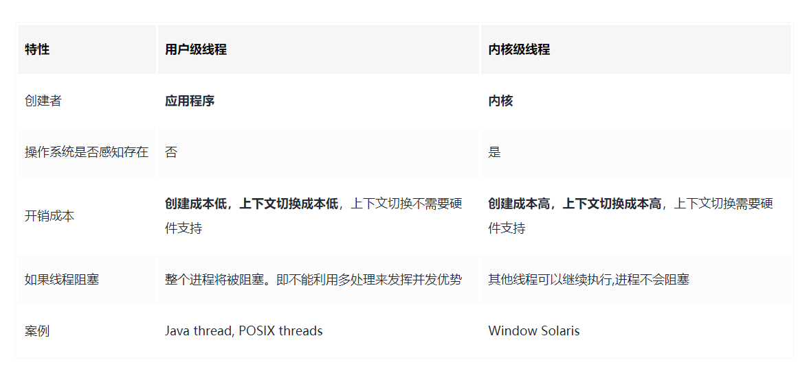
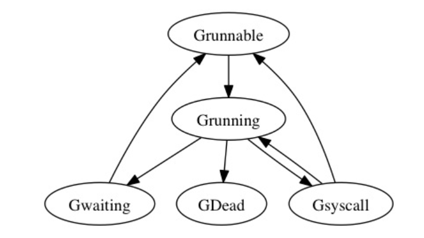
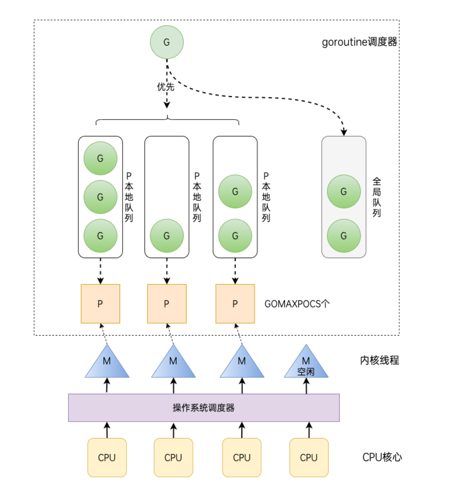
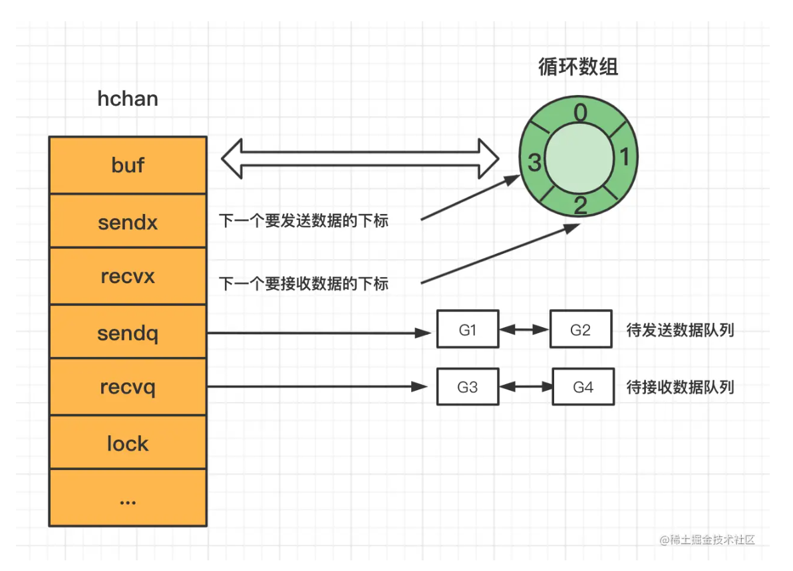
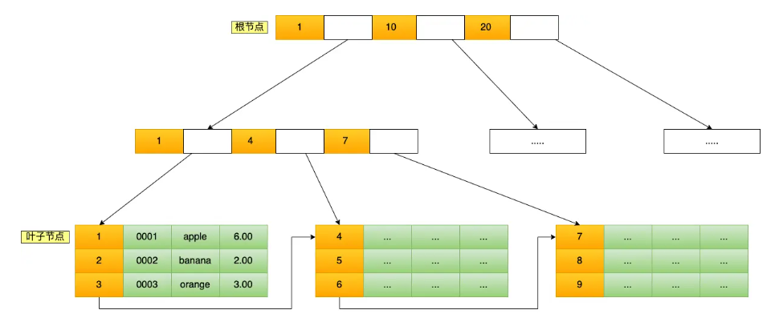
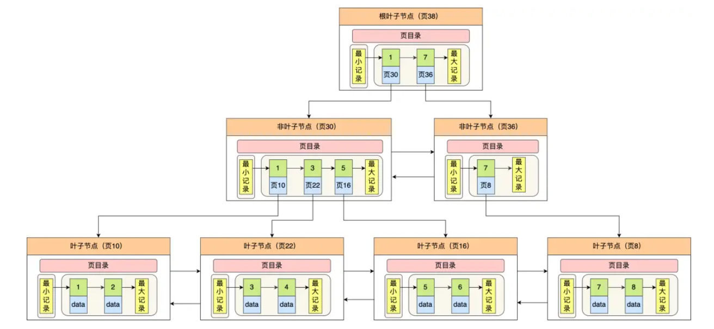

# Go

## 数组与slice

### Array

数组在声明时必须指定大小，且大小无法改变。编译期间，数组包含两个结构：元素类型```Elem```和大小上限`Bound`。数组上限不论是显示还是隐式的都会在**编译进行类型检查**时被推导出。

数组元素个数小于等于4个,所有变量会直接在栈上初始化,如果数组数量大于4个,变量就会在静态存储区初始化然后拷贝到栈上。

数组在内存上就是一连串的内存空间，表示数组的方式就是指向数组开头的指针

数组的寻址、赋值、越界判断等都在**编译**期间发生

### Slice

切片实际上就是动态数组。其包括三个部分：指针、长度和容量

```go
type SliceHeader struct {
    Data uintptr // 指向数组的指针
    Len  int // 当前切片长度
    Cap  int // 切片的容量
}
```

#### slice 的 Append

当cap足够时，直接修改len并在原处添加

当cap不足时，需要将cap扩容到合适大小后，在新的一块内存区域开辟cap大小并将原slice复制过来，再逐个添加新元素。调用`runtime.growslice`

- 如果期望容量大于当前容量的两倍就会使用期望容量
- 如果当前切片容量小于256就会将容量翻倍
- 如果当前切片容量大于256就会开始进行缓慢增长，增长比例从2靠近1.25，直到新容量大于期望容量

#### slice的线程安全

slice不是线程安全的。若使用多个goroutine对slice进行操作，将操作同一片内存空间，例如一个正在读一个正在修改，可能会导致读线程读到错误信息；或是一个在append操作，一个在读或写，可能导致slice的扩容，导致读写失效。

### 数组与slice的遍历

对于range循环，编译期间会将原切片或数组赋值给一个新的变量，此时就已经发生了拷贝。因此在range遍历切片的时候遍历的不是原有的切片了。

当同时遍历索引和元素的range循环时，go会额外创建一个新的v2变量来存储切片中的元素，遍历的每一步v2都会被赋值，也就是会发生拷贝。因此，&v2获得的不是我们想要的数组或切片元素的地址。想要获取地址应该用&a[index]

## Map

### 哈希冲突解决

#### 开放寻址

- 在一堆数组对元素进行探测和比较以判断待查找的目标键是否存在当前的哈希表中
- 初始化哈希表时会创建一个新的数组,如果哈希表写入新的数据发生了冲突,就会将键值对写入到下一个不为空的位置
- 查找时,按照我的理解,应该是先哈希key,找到对应的位置上,然后对比key,如果不一样,继续往下找,除非找到对应的key或者内存为空为止
- 数组中元素数量与数组大小的比值叫做装载因子,随着装载因子增加,线性探索的评价用时就会逐渐增加,到百分之七十之后性能明显下降,一旦到百分之百,整个哈希表就会完全失效

#### 拉链法

- 就是数组加上链表组合起来实现哈希表,数组中每个元素都是一个链表
- 插入时,先对key进行hash,找到数组上对应的点(桶),然后遍历桶里的链表,如果有相同的就修改,没有就加在链表最末尾
- 性能比较好的哈希表中,每个桶里大约有0或者1个元素,偶尔会有2到3个,很少会超过这个数

go使用**拉链法**来解决哈希冲突

### Map的结构

```go
type hmap struct {
    count     int // 用于记录当前哈希表元素数量,这个元素让我们不在需要去遍历整个哈希表来获取长度
    flags     uint8
    B         uint8  // 表示当前哈希表持有的 `buckets` 数量,因为哈希表扩容是以2倍进行的,所以这里会使用对数来存储, 简单理解成 `len(buckets) == 2^B` 
    noverflow uint16
    hash0     uint32 // 哈希的种子,这个值会在调用哈希函数时作为参数传入进去,主要作用是为哈希函数的结果引入一定的随机性

    buckets    unsafe.Pointer
    oldbuckets unsafe.Pointer // 哈希在扩容时用于保存之前的 `buckets`的字段,它的大小是当前`buckets`的一半
    nevacuate  uintptr

    extra *mapextra
}
```

#### 桶的结构

```go
type bmap struct {

    // tophash，作用下文说明

    topbits  [bucketCnt]uint8   // bucketCnt = 8

    keys     [bucketCnt]keytype

    values   [bucketCnt]valuetype

    pad      uintptr

    // 指向溢出桶

    overflow uintptr

}
```

可以看出，一个桶中最多存有8个键值对。若超过八个键值对，就要新建溢出桶并存在溢出桶上。`overflow`指向下一个溢出桶，如同链表。

### Key的定位

1. 计算hash(key)
2. 根据哈希值定位在哪个桶。hash值的最后B位用于定位桶，计算方法为`len(buckets) ^ (hash后B位)`
3. 定位槽。定位到桶后，要具体查看在哪个地址（槽）。在go中有一个`topbits`数组由于存储每个key的hash值前八位，若该hash值存在于topbits数组中，则其大概率在该槽，可以通过topbits的下标快速查找到key和value的地址进行比对；若不在，则肯定不在该槽。由于整数的对比相较于其他数据类型的对比更快，所以使用这个方法可以快速排除不属于该槽的key。
4. 若当前桶没有找到，若有溢出桶则要继续查找溢出桶

### 扩容

#### 扩容条件

**元素过多**（桶里元素数大于8且总元素个数大于6.5*桶个数）或**溢出桶过多**

溢出桶过多：大量添加元素后再删除，形成许多空洞，查询时需额外扫描空位置，影响性能

扩容发生在赋值、删除操作时

#### 扩容过程

1. 首先`hashGrow`会做一些预备工作，例如创建新的桶数组，若为元素过多，则将数组容量翻倍。否则是溢出桶过多，采用原桶容量（元素不多，不需要更大的容量，只是需要重新整合，消除溢出桶）
2. 将新桶数组挂到buckets,老桶数组则转移到oldbuckets
3. 渐进式扩容。将一个老桶的元素放到两个新桶中。每次移动两个桶，均摊复杂度，但实现复杂

扩容会影响map的访问(mapaccess)。若当前正在扩容且要查询的老桶还没搬迁，需要到oldbuckets去找。这样会引发并发问题，即若访问线程认为在老桶，在访问之前扩容线程搬迁了该老桶，则会导致访问线程找不到该元素。因此在并发环境下需要使用`sync.Map`

另外若在扩容过程中，写入操作也有变化，写入之前会把该key对应的老bucket迁移，并将数据写入新桶，此时读取默认从新桶读。

### 遍历

遍历就是从第一个桶第一个元素往后遍历即可。要注意以下两点：

- 随机性：每次for range循环顺序不同
- 考虑扩容：由于渐进式扩容，可能遍历时也在扩容，需要考虑去新map还是旧map找数据

#### 随机性

go的map每次调用遍历结果顺序不一样，其实现为开始遍历的桶startBucket不一样，且遍历每个桶时开始位置offset也不同，若offset = 3，则每个桶遍历顺序为 [3，4，5，6，7，0，1，2]

防止程序员依赖特定的迭代顺序

#### 考虑扩容

若遍历时发生扩容，可以有两种情况

1. 遍历开始前正在扩容：遍历到新桶时，需要判断老桶是否迁移，迁移正常遍历；若没有迁移，则**遍历老桶中要被迁移到该新桶的部分元素**，其余的下次再遍历
2. 遍历时没有扩容，过程中开始扩容：由于初始化时hiter.B保留了当时桶的个数，hiter.buckets保留了之前桶的指针。若为等量扩容，则如1一样在新桶上遍历，否则在老桶上遍历。迁移只有在没有其他协程遍历老桶的时候才会清空老桶，但key数据可能被更新或删除了，因此也需要到新桶确认一下。但若遍历该桶之前就被清空了，就可能查不到数据，因此最好不要边遍历便修改map。

## Interface

类型定义，具有共性的方法定义在一起。一个接口可以被多个结构体实现。

接口本质上就是**类型**，一个和slice等一样是类型，但是一个抽象而非如slice是具体的类型，只关心能做什么

“不关心它是什么，只关心它能做什么”

其本质就是引入一个中间层对不同的模块进行解耦,上层的模块就不需要依赖某一个具体的实现! Go语言中的接口`interface` 不仅是一组方法,还是一种内置的类型

```go
type interface_name interface {
    method_name1 [return_type]
    ...
}
```

Go语言中所有的接口的实现都是隐式的：类中不用明确实现了哪些接口

实现接口必须实现接口中所有方法。

接口包括一个`type`指针和指向value的指针。type为动态类型，value为动态值

```go
type iface struct {
    tab  *itab
    data unsafe.Pointer
}
```

一个类型可以实现多个接口；多个类型可以实现同一个接口（多态）

对于任意实现接口的类，接口变量的`type`可以指向该类型。一个接口类型的变量能够存储所有实现了该接口的类型变量，空接口类型的变量可以存储任意类型的值。

```go
type Pet interface {
    eat()
}
type Dog struct {
}
type Cat struct {
}
func (dog Dog) eat() {
	// ...
}
func (cat Cat) eat() {
	//...
}
func main() {
	var pet Pet
    pet = Dog{}
    pet = Cat{}
    //多态实现
}
```

接口也可以嵌套，接口内可以有很多接口

**接口实际上是一个指针，包括一个type和一个value，value指向该接口type的一个实例或该类零值。接口为nil当且仅当接口是空接口，即type为nil**。因此，使用接口判断nil是很危险的，因为若type被指定则不是空接口，接口也就不是nil

**动态派发**是指运行期间选择具体的多态操作执行的过程。在Go语言中,对于一个接口类型的方法调用,会在运行期间决定具体调用该方法的哪个实现

**类型断言**返回两个值：v为x转化为T类型后的的变量，ok为一个bool值，表示是否是该类型

```go
v, ok := x.(T)
//eg
var n Mover = &Dog{Name: "旺财"}
v, ok := n.(*Dog)
if ok {
	fmt.Println("类型断言成功")
	v.Name = "富贵" // 变量v是*Dog类型
} else {
	fmt.Println("类型断言失败")
}
```

OCP：扩展开放，修改关闭

## 函数

### 调用惯例

相较于C的函数参数使用寄存器和栈传递，Go传递和接收参数使用的都是栈

- 函数入参和出参的内存空间需要调用方在栈上分配
  - 能降低实现的复杂度，不需要考虑超过寄存器个数的参数应该如何传递
  - 方便兼容不同硬件
  - 函数可以有多个返回值，因为香蕉寄存器栈的空间是无限的
- 入栈顺序从右到左（和c++一样）
- 函数返回通过堆栈传递并由调用者预先分配内存空间

### 参数的传递

**值传递！！！！**

- 不论是基本数据类型、结构体还是指针，都会对传递的参数进行拷贝。其中对slice、map、channel等传递时是传递一个类似引用的东西，也就是拷贝一份别名，其余是深拷贝，也就是值拷贝。
- 指针作为参数时也是值传递，是对指针进行复制，也就是会出现两个指针指向原有内存空间。
- 调用函数都是传值，接收方会对入参进行复制再计算。

## 字符串

Go语言的字符串是一个**只读**的字节数组([]byte)切片。代码中的字符串会在编译期间标记成只读数据，标记这个字符串会被分配到只读的内存空间且这段内存不会被修改，直接修改string类型变量的内存空间是不被允许的。

字符串的结构如下：

```go
type StringHeader struct {
    Data uintptr
    Len  int
}
```

字符有两种类型，一种是**byte(uint8)**型，代表ascii字符；另一种是**rune(int16)**类型，代表utf-8字符。

对于字符串的修改，需要先将字符串转换成[]byte或[]rune类型，完成后再转为string。无论哪种转换，**都会重新分配内存并复制字节数组**。

因此，**字符串和字节数组切片的相互转换都是对内容进行拷贝**，需要考虑性能问题。

在使用range遍历时，过程中会获取索引对应的字节，然后将字节转成rune，遍历时一直拿到的都是rune类型变量。

## defer

每个 defer 语句都对应一个_defer 实例，多个实例使用指针连接起来形成一个单连表，保存在 gotoutine 数据结构中，每次插入\_defer 实例，均插入到链表的头部，函数结束再一次从头部取出，从而形成后进先出的效果。

defer用于资源的释放，会在函数返回前进行调用。如果有多个表达式，调用顺序后进先出，越后面的defer表达式越先被调用。只对当前goroutine起效。

```go
f,err := os.Open(filename)
if err != nil {
    panic(err)
}
defer f.Close()
```

**return xxx 不是一条原子指令。函数调用的返回过程：先给返回值赋值，然后调用defer，最后返回到调用函数**。defer表达式可能会在设置函数返回值之后，在返回到调用函数之前，修改返回值，使最终的函数返回值与你想象的不一致。

goroutine的控制结构中，有一张表记录defer，每出现一次defer，就调用runtime.deferproc将需要defer的表达式记录在表中，而在调用runtime.deferreturn的时候，则会依次从defer表中出栈并执行。

## panic和recover

panic能改变程序控制流。当函数调用panic时，程序会立刻停止执行函数的剩余代码，运行defer函数，执行成功后返回调用方。只对当前goroutine起效

recover可以终止panic造成的程序崩溃。由于recover必须在panic之后使用，而panic之后会直接调用defer，所以**recover只能在panic中起效**。

在调用到panic时，将循环不断从当前goroutine的defer表中获取defer函数并执行。若在某个defer函数中查找到了recover，则获取该defer函数中的程序计数器和栈指针并恢复。若没有就会执行完所有defer函数后返回。

也有一些错误是无法恢复的。如内存不足。

## make和new

**make的作用是初始化内置的数据结构，如slice、map之类的**

**new的作用是根据传入的类型分配一片内存空间并返回指向这片内存空间的指针**

## goroutine

### 进程、线程和协程

进程：可以认为是一个程序的一次执行过程，是系统资源分配和调度的独立单位。每个进程都有独立的内存空间，不同的进程通过进程间的通信方式来通信。

线程：从属于进程，每个进程至少包含一个线程，线程是 CPU 调度的基本单位，是系统调度执行的最小单位。多个线程之间可以共享进程的资源并通过共享内存等线程间的通信方式来通信。**其切换和创建成本高。**

协程：为**用户级轻量级线程**，**由应用程序创建和管理**。操作系统无法感知协程存在。协程的调度器由用户应用程序提供，协程调度器按照调度策略把协程调度到线程中运行。**由于在用户态，其切换和创建成本低。**

**线程由CPU调度，是抢占式的；协程由用户态调度，是协作式的，一个协程让出CPU后，才执行下一个协程。**



用户级线程模型：M：1；内核级线程模型：1：1；混合型线程模型：M：N

**并发：同一个时间段内执行多个任务。**go中的并发程序主要通过基于CSP（communicating sequential processess）的goroutine和channel实现。当然也支持传统的多线程共享内存/锁并发方法。

### goroutine

goroutine是go并发的核心，是协程。其工作在**用户态**，不受操作系统内核调度，而由go运行时（runtime）负责调度，go运行时会智能地将m个goroutine交由n个操作系统线程。一个goroutine将以一个很小的栈开始生命周期，一般只需要2KB。go的运行至少需要一个goroutine：main goroutine

在go中，若想让某个任务并发执行，只需要将其包装成一个函数，然后用`go`关键字就可以让这个任务在一个goroutine中执行了。一个goroutine必定对应一个函数/方法，一个函数/方法可以由多个goroutine执行。

```go
go f()
go func() {}age
```

对于一个goroutine，若其结束，所有在该goroutine中创建的goroutine都会结束。其中，main goroutine结束的话所有该程序的goroutine都会结束。

#### 动态栈

操作系统的线程一般有固定的栈内存(通常为2MB)。而goroutine的初始栈空间很小，一般只有2KB。goroutine的栈不是固定的，可以动态增大或缩小。**go的runtime会自动为goroutine分配合适的栈空间**，可达GB级。

#### goroutine状态变化



### goroutine调度机制

#### GMP调度模型

go的调度模型称为**GMP调度模型**。这是一个go runtime层面的实现，不由操作系统控制。goroutine和内核级线程的关系是N：M，也就是**混合级线程模型**。

- G(goroutine)：即goroutine。每当调用go就会产生一个G，包含要执行的函数和上下文信息。是参与调度和执行的最小单位。理论上没有数量限制。
- M(Machine)：工作线程。一个M代表了一个内核级线程，由操作系统调度器将该M分配到CPU核上运行。M一般对应真正的CPU数。一般使用SetMaxThreads函数设定M最大数量。
- P(Processer)：处理器，是go的一个概念，非CPU。**包含运行go代码必要资源，也有调度goroutine的能力**。P关联了本地可运行G的队列(LRQ)，最多可以存放256个G。最多可以有`GOMAXPOCS`(默认等于核心数)个P。所有的P被组织成一个数组，这是为了工作窃取：work stealing

GMP调度流程大致如下：

- 内核级线程M想要运行G，就要与一个P关联。
- 关联后可以从P本地队列中获取一个G。
- 若该P的本地队列中没有可运行的G，M会尝试从全局队列中获取一部分G放入P的本地队列中。
- 若全局队列中也没有可以运行的G，则M会随机从其他P的本地队列中偷一半放到自己P的本地队列。
- 拿到可运行的G后，M就运行G。当前G执行后，M会从P获取下一个G，不断重复下去。
  - 若当前G需要执行系统调用，M就会带着这个G进行系统调用。此时若有别的M空闲，就会接手原来M的P继续执行剩下的G。当系统调用执行完后，原来的M会观察是否有P可以连接，没有就返回线程池睡眠。因此，**为了让P尽可能地一直有M连接，M数量一般要稍大于P**。



#### 调度的生命周期


- m0是启动程序后编号为0的主线程，实例位于全局变量`runtime.m0`，不需要在heap上分配。m0负责执行初始化操作和启动第一个G，之后和其他M一样。
- g0是每次启动一个M都会第一个创建的goroutine，不由用户代码创建，而是go运行时内部创建管理。对于每一个M，**g0负责执行运行时调度和系统调度相关的操作。当一个G要进行系统调度或者运行时调度(如goroutine的创建和切换)时，就会切换至g0，使用g0的栈空间完成调度操作**，这样可以避免在自己栈上产生额外的负担。全局变量`runtime.g0`指的是m0的g0.

上述的生命周期流程说明：

- runtime创建最初的m0和g0，并将二者关联(g0.m=m0)
- 初始化调度器：设置M最大数量，P个数、初始化栈和内存，创建GOMAXPROCS个P
- `runtime.main`调用`main.main`，程序启动时会为`runtime.main`创建main goroutine，加入P本地队列
- 启动m0，绑定P，从P本地队列中获取G也就是main goroutine
- M根据G中的栈信息和调度信息设置运行环境
- M运行G
- G退出，M获取下一个可运行的G，重复直到`main.main`退出，`runtime.main`执行defer和panic处理，或调用runtime.exit退出程序

#### 调度的流程状态

- goroutine将优先进入P本地队列。若本地队列已满则加入全局队列。
- 每个P和一个M绑定，M是执行goroutine的实体，不断获取P本地队列的G运行。
- 当P本地队列没有G，则M会去全局队列中拿一部分可运行的G放到P本地队列中。若全局队列中也没有，M会随机从别的M哪里拿一般可运行的G放到P本地队列中。
- 若P本地队列已满，则将本地队列前一半打乱后和新来的G一起放入全局队列。
- 当G因系统调用(system call)而阻塞时，G会被阻塞在_Gsyscall状态，M会跟着一起被阻塞，处于block on system状态，此时的M可被抢占调度：执行G的M与P解绑，P去寻找一个空闲的M继续执行，若没有空闲的M则创建。当系统调用完成，G会尝试重新找一个空闲的P并加入其本地队列，没有的话标记为runnable放入全局队列。
- 当G因channel或network I/O，也就是用户态阻塞时，M不会被阻塞。此时G会被放置到某个wait队列并状态由\_Gruning变为_Gwaitting，而M则会跳过该G尝试获取并执行下一个runnable的G。若此时哪里都没有可运行的G，则M解绑P并自旋。当被阻塞的G被另一端的G2唤醒时，G被标记为runnable，并尝试加入G2所在P的runnext(一个比本地队列优先级更高的G)，然后是P的本地队列，最后全局队列。

#### 总结

- GMP调度模型是一个混合式线程模型，协程和内核级线程是N：M
- G：goroutine，M：系统级线程Machine，P：逻辑处理器Processor
- 每个M都与一个P绑定，M是执行G的主体。每个P都有一个本地队列装有可运行的G，M将不断获取里面的G运行。若里面没有G，则去全局队列找可运行的G，若也没有，则随机去别的P那里拿一半(work steal)。若都未找到，M会和P解绑并自旋，不会销毁。
- 当执行G的时候，如果G发生用户级阻塞，则将G放入对应wait队列中，M将执行下一个可运行的G。若G发生系统级调用，则M会和G一起阻塞，发生抢占式调度，P会和M解绑(hand off)并寻找空闲M或创建一个新的M绑定。
- go的抢占比较初级，只是对长时间运行的goroutine打一个标签(stackguard设置为StackPreempt)，若其调用其他函数(StackPreempt大于实际栈大小，调用函数会触发morestack)，就让这个G先暂停，让出M。
- **GMP保持高效的策略：**
  - M可反复利用，不需要反复创建与销毁，如同线程池。
  - work steal和hand off保证M和P的高效利用
  - 内存分配状态位于P，G可以跨M调度，不存在跨M调度局部性差的问题
  - M从关联的P中获取M，不需要使用锁，是lock free的(这是由于P只能操作本地的G，不能操作别的P的G)

## channel

Go语言采用的并发模型是`CSP（Communicating Sequential Processes）`，提倡**通过通信共享内存**而不是**通过共享内存而实现通信**。channel就是传送信息的载体，其像一个队列，遵循FIFO，底层是一个**循环数组**。每一个channel都是一个具体类型的channel，需要为其指定元素类型。

### 数据结构

channel的底层是一个hchan的结构体，位于runtime下

```go
type hchan struct {
  //channel分为无缓冲和有缓冲两种。
  //对于有缓冲的channel存储数据，借助的是如下循环数组的结构
	qcount   uint           // 循环数组中的元素数量
	dataqsiz uint           // 循环数组的长度
	buf      unsafe.Pointer // 指向底层循环数组的指针
	elemsize uint16 //能够收发元素的大小
  

	closed   uint32   //channel是否关闭的标志
	elemtype *_type //channel中的元素类型
  
  //有缓冲channel内的缓冲数组会被作为一个“环型”来使用。
  //当下标超过数组容量后会回到第一个位置，所以需要有两个字段记录当前读和写的下标位置
	sendx    uint   // 下一次发送数据的下标位置
	recvx    uint   // 下一次读取数据的下标位置
  
  //当循环数组中没有数据时，收到了接收请求，那么接收数据的变量地址将会写入读等待队列
  //当循环数组中数据已满时，收到了发送请求，那么发送数据的变量地址将写入写等待队列
	recvq    waitq  // 读等待队列
	sendq    waitq  // 写等待队列


	lock mutex //互斥锁，保证读写channel时不存在并发竞争问题
}
```

图解如下



主要有以下四个部分：

- buf：指向循环数组的指针
- sendx和recvx：分别是下一个要写入数据或要读取数据的下标值
- sendq和recvq：当循环数组为满/空时，试图写入/读取该chan的G将被阻塞在sendq/recvq上
- lock：保证对chan写入读取安全的

### chan的读写

**不论是对chan的写入还是读取，都是值传递，也就是复制。**

根据GMP调度模型，若G往一个满chan里写数据，这个G会被阻塞，但不是系统阻塞，**是用户态阻塞**。这种情况M不会跟着G一起被阻塞，而是调度器将G设置为Gwating，放到对应的waitq里，然后执行下面的runnable的G。这里的waitq，在chan数据结构里就是sendq。

下面是waitq的数据结构：

```go
type waitq struct {
	first *sudog
	last *sudog
}
```

在G被设置为Gwating后，会创建一个sudog结构，然后放到sendq这个链表内。当chan内有位置可以写后，该G会被唤醒置为Grunnable，然后先尝试放进唤醒其的G的P的runnext，若不行尝试进入本地队列或全局队列。读也基本是一样的道理，接下来简单说一下读写流程。

#### 向chan写数据

1. 若recvq不为空，则说明chan为空或没有缓冲区，**直接从recvq取出G，并把数据写入G，**再把G唤醒，结束写流程。
2. 若环形数组有空闲位置，则写入，sendx++，结束写流程。
3. 若缓冲区已满，则将发送数据写入G，将当前G加入sendq后阻塞，等待被读G唤醒。

#### 从chan读数据

1. 若sendq不为空且没有缓冲区，则直接从sendq取出G，复制得到数据后唤醒G，结束读流程。
2. 若sendq不为空且缓冲区已满，则从recvx读数据，recvx++，把G中数据写入sendx，sendx++，唤醒G，结束读流程
3. 若缓冲区有数据，则取出数据，完成读流程
4. 若缓冲区无数据，则加入recvq后阻塞，等待被写G唤醒。

**代码中先写的goroutine不能保证先读到数据，但先执行的goroutine一定能先读到数据**。这是因为每一个goroutine抢到处理器的时间不一致，goroutine的执行本身不能保证顺序。

### channel的关闭以及判断关闭的方式

首先明确一点，**go没有提供一种在不读chan的情况下判断chan是否关闭的方式。**用len(ch)来判断是不可靠的。

我们可以使用多返回值的方式判断chan是否关闭：

```go
v, ok := <-ch	\\ok = true: not close; ok = false: close
```

for range读channel是很安全且便利的方法。因为for range读取会在channel关闭时，读完channel里的所有数据后自动退出，可以防止读取已经关闭的channel

```go
for i := range ch {
	fmt.Println(i)
}
```

我们也可以使用select来监听多个channel，只处理最先发生的channel时很实用

```go
for{
  select {
  case <-ch1:
  	process1()
  	return
  case <-ch2:
  	process2()
  	return
	}
}
```

原理：`select`可以同时监控多个通道的情况，只处理未阻塞的case。若没有可处理的会阻塞直到有可处理的。

- 当通道为nil时，对应的case永远为阻塞。
- 如果channel已经关闭，则这个case是非阻塞的，每次select都可能会被执行到(因为关闭chan也可读)。
- 如果多个channel都处于非阻塞态，则select会**随机**选择一个执行。

channel关闭有几个注意事项：

- 对一个关闭的channel再发送值就会panic
- 对一个关闭的channel进行接收会一直获取值直到channel为空
- 对一个关闭的且没有值的channel接收会接收到对应类型零值
- 对一个关闭的或nil通道再次关闭会panic

## select多路复用

go在实现select时，定义了一个数据结构表示每个case语句(含defaut，default实际上是一种特殊的case)。select执行过程像一个函数，输入case数组，输出选中的case，然后程序流程转到选中的case。

### case数据结构

```go
type scase struct {
    c           *hchan         // chan
    kind        uint16
    elem        unsafe.Pointer // data element
}
```

c表示当前case所操作的channel的指针，这也表示一个case只能处理一个channel。

kind表示该case类型，包括读channel(caseRecv)，写channel(caseSend)和default(caseDefault)

elem指向case的缓冲区地址。根据kind的不同决定用途：若为读，则elem表示从channel读出元素的存放地址；若为写，则elem表示将要写入channel的元素的存放地址。

### select实现逻辑

实现逻辑在src/runtime/select.go:selectgo()

```go
func selectgo(cas0 *scase, order0 *uint16, ncases int) (int, bool) {
    //1. 锁定scase语句中所有的channel
    //2. 按照随机顺序检测scase中的channel是否ready
    //   2.1 如果case可读，则读取channel中数据，解锁所有的channel，然后返回(case index, true)
    //   2.2 如果case可写，则将数据写入channel，解锁所有的channel，然后返回(case index, false)
    //   2.3 所有case都未ready，则解锁所有的channel，然后返回（default index, false）
    //3. 所有case都未ready，且没有default语句
    //   3.1 将当前协程加入到所有channel的等待队列
    //   3.2 当将协程转入阻塞，等待被唤醒
    //4. 唤醒后返回channel对应的case index
    //   4.1 如果是读操作，解锁所有的channel，然后返回(case index, true)
    //   4.2 如果是写操作，解锁所有的channel，然后返回(case index, false)
}
```

- cas0为scase数组的首地址，selectgo()就是从这些scase中找出一个返回。
- order0为一个两倍cas0数组长度的buffer，保存scase随机序列pollorder和scase中channel地址序列lockorder
  - pollorder：每次selectgo执行都会把scase序列打乱，以达到随机检测case的目的。
  - lockorder：所有case语句中channel序列，以达到去重防止对channel加锁时重复加锁的目的。
- ncases表示scase数组的长度

注意：对于读case来说，若channel有可能被其他协程关闭，则要判断是否读取成功，也就是判断ok。因为关闭channel仍然可读，返回类型零值，channel是可能走被关闭channel读取的。

### 总结

- select里除了default，只会操作一个channel，要么读要么写。
- select除了default，各case执行顺序随机。
- 若select没有default语句，则阻塞等待任一case可操作
- select语句读操作需要判断是否读成功，因为被关闭的channel仍可读。

## 并发安全与互斥锁

### sync.Mutex

Mutex就是最经典的互斥锁。其暴露了两种方法，Lock()加锁和Unlock()解锁。

#### Mutex数据结构

```go
type Mutex struct {
    state int32			//表示互斥锁状态，如是否被锁定
    sema  uint32		//信号量。协程阻塞等待该信号量，解锁的协程释放信号量从而唤醒等待信号量的协程
}
```

Mute下内存布局如下：


- Waiter：表示阻塞等待该锁的协程个数。根据这个字段判断是否需要释放信号量。
- Starving：表示该锁是否处于饥饿状态，0不在1在，1说明有协程等待超过1ms
- Woken：表示是否有协程已被唤醒，0没有，1有，协程正在加锁过程。
- Locked：判断该锁是否被占有。0没有1有。

协程抢锁实际上就是竞争给Locked赋值的权利。一旦持有锁的协程解锁，等待的协程会被依次唤醒。

#### 加解锁过程

##### 简单加锁

当前只有一个协程在加锁，没有别的协程干扰。该协程回去判断Locked位是否为0，如果是就置1，代表加锁成功。

##### 加锁被阻塞

当一个协程试图加锁发现Locked位是1时，该协程将被阻塞。Waiter计数器将加一，被阻塞协程只有Locked为0获得信号量时才会被唤醒。

##### 简单解锁

假设解锁时，没有别的协程阻塞，即Waiter为0，则直接将Locked位置设置为0即可，不需要释放信号量。

##### 解锁并唤醒协程

若解锁时协程发现Waiter大于0，则首先将Locked置0，然后在Woken不为1的情况下，协程释放一个信号量，唤醒一个阻塞的协程，由该协程来进行加锁过程。

#### 自旋过程

加锁时，若Locked为1，尝试加锁的协程并不是马上转入阻塞，而是持续探测Locked位是否变为0，这个过程就是自旋过程。

自选时间很短，若自旋过程发现Locked变为0，则立刻获得锁。此时就算有其他被阻塞线程被信号量唤醒，也无法获得锁，只能继续阻塞。

自旋的好处是一个协程有可能不被阻塞就获得锁，一定程度减少协程切换。

##### 自旋条件

由于无限制的自旋会给CPU带来巨大压力，因此判断是否能自旋就很重要。自旋必须满足下面四个条件

- 自选次数足够小，通常不超过4次。
- CPU核数要大于1，否则自旋没有意义，因为此时不可能有其他协程释放锁
- P的数量要大于1，因为若P的数量等于1也没有别的协程可以释放锁
- GMP中可运行队列必须为空，否则延迟协程调度

总之，自旋有十分苛刻的条件，只有”不忙“的时候会启动自旋。

##### 自旋优缺点

自旋的好处就在于减少协程切换。一个运行的协程有机会在不被阻塞情况下获得锁，减少切换。

缺点也很明显，如果所有协程都通过自旋获得锁，之前被阻塞的协程就无法获得锁。为了解决这个问题，Mutex在go 1.8后加入了Starving状态，这种状态下不会自旋。一旦有协程释放锁，就一定会唤醒一个协程并加锁。

#### Mutex模式

Mutex有两种模式：Normal和Starving，对应Starving位为0或1。默认为Normal。

- Normal模式：这种情况下，加锁协程发现该锁已被占有会先自旋，不会立刻阻塞。
- Starving模式：释放锁时如果发现有被阻塞的协程，解锁协程会发出一个信号量来唤醒一个等待协程。由于自旋的存在，被唤醒协程可能会发现这个锁又被用了，只好再次阻塞。不过在阻塞前会记录上次阻塞到本次阻塞耗费了多长时间，若大于1ms就会将Starving置1。此时自选模式将被停止。下次协程释放锁时将一定会释放信号量唤醒一个协程来获取锁。

#### Woken

Woken字段用于协程间通信，在**饥饿模式下不可用**。假设一个协程和另一个协程同时加锁解锁，加锁这个协程会将Woken位设置为1，这样解锁协程就不会再释放信号量来唤醒阻塞的协程，减少不必要的上下文切换和竞争。

#### 为何重复解锁会panic

很简单。假设Waiter里的数较大，说明很多协程阻塞在这个锁上。若可以重复Unlock，势必会多次释放信号量唤醒多个阻塞协程在Lock逻辑里抢锁，这会增加Lock的实现难度，引起不必要协程切换。

#### Tips

在Lock后紧接着使用defer Unlock()能有效避免死锁。加解锁最好在同一代码块(如函数)中。

### sync.RWMutex

对于读取数据频率远远大于写的情况，使用Mutex可能不是很合算，因为多个读协程是可以同时读的。RWMutex就是一个读写锁，其提供四个方法：**读锁定(RLock())，写锁定(Lock()，与Mutex完全一致)，读解锁(RUnlock)，写解锁(Unlock()与Mutex完全一致)**。读写锁逻辑如下：

- 有协程持有写锁，则读或写的协程都将阻塞
- 有协程持有读锁，则写协程被阻塞，读协程可以继续获取读锁。

#### RWMutex数据结构

```go
type RWMutex struct {
    w           Mutex  //用于控制多个写锁，获得写锁首先要获取该锁，如果有一个写锁在进行，那么再到来的写锁将会阻塞于此
    writerSem   uint32 //写阻塞等待的信号量，最后一个读者释放锁时会释放信号量
    readerSem   uint32 //读阻塞的协程等待的信号量，持有写锁的协程释放锁后会释放信号量
    readerCount int32  //记录读者个数
    readerWait  int32  //记录写阻塞时读者个数
}
```

RWMutex内部也有一个Mutex锁，用于隔离写操作。其余用于隔离读操作和写操作

##### Lock()实现逻辑

1. 获取互斥锁w，这是前提
2. 等待所有读操作结束，也就是等到readerWait=0

##### Unlock()实现逻辑

1. 若readerCount>0，则释放readerSem，唤醒被阻塞的读协程
2. 解除互斥锁，跟Mutex解锁一样

##### RLock()实现逻辑

1. readerCount++
2. 阻塞等待写操作结束，也就是w已被获取(w的Locked)

##### RUnlock()实现逻辑

1. readerCount--
2. 若readerCount=0，则释放witerSem，唤醒写操作协程

#### 写操作如何阻止读操作的

readerCount的范围是0~2^30，即最大可能可以支持2^30并发读者。**当写锁定进行时时，会将readerCount减去2^30，将其变成负值。当读协程到来发现readerCount为负值时，就知道有写协程获取了锁，就会阻塞**。当释放锁时，就会加上2^30，然后判断是否大于0来判断是否释放readerSem唤醒读协程。

#### 读操作时如何阻止写操作的

读锁定会将readerCount++，若写协程来时发现readerCount大于0，就会阻塞等待所有读协程结束。

#### 为何写锁定不会被饿死

写操作到来时，**会把readerCount值拷贝到readerWait中**。标记排在写协程前的读者个数。前面的读协程结束后，不仅会**readerCount--，还会readerWait--**，**当readerWait变为0后唤醒写协程**。

因此，写操作等于将一段的读操作划分为两部分，前面的读操作结束后唤醒写操作，写操作结束后唤醒后面的读操作。

### sync.WaitGroup

WaitGroup的作用是让一个goroutine阻塞等到其他goroutine全部完成。其主要有三个方法：

```go
var wg sync.WaitGroup
wg.Add(delta int)		//向WaitGroup里增加delta个计数
wg.Done()				//若一个goroutine完成，就调用Done让WaitGroup计数减一
wg.Wait()				//阻塞调用其的goroutine直到wg计数为0才被唤醒
```

WaitGroup的实现使用了信号量。信号量是一种保护共享资源的机制，信号量其实就类似于一个数值：

- 信号量大于0，说明资源可用。一个线程获得资源后将自动将信号量-1
- 信号量等于0，则资源不可用，申请该资源的线程将阻塞等待信号量大于0

#### 数据结构

```go
type WaitGroup struct {
    state1 [3]uint32
}
```

state1里面有三个部分：counter、waiter和semaphore。counter和waiter是两个计数器，组成state；semaphore是信号量


- counter：该goroutine组内当前未执行结束的goroutine个数
- waiter：等待该goroutine组完成的goroutine个数
- semaphore：信号量

#### Add(delta int)

Add主要做了两件事：把delta值加到counter中，delta可正可负，counter也可以取负值。第二件事是若counter变为0，根据waiter释放等量的信号量，唤醒所有等待的goroutine。若counter变为负值，则panic

```go
func (wg *WaitGroup) Add(delta int) {
    statep, semap := wg.state() //获取state和semaphore地址指针

    state := atomic.AddUint64(statep, uint64(delta)<<32) //把delta左移32位累加到state，即累加到counter中
    v := int32(state >> 32) //获取counter值
    w := uint32(state)      //获取waiter值

    if v < 0 {              //经过累加后counter值变为负值，panic
        panic("sync: negative WaitGroup counter")
    }

    //经过累加后，此时，counter >= 0
    //如果counter为正，说明不需要释放信号量，直接退出
    //如果waiter为零，说明没有等待者，也不需要释放信号量，直接退出
    if v > 0 || w == 0 {
        return
    }

    //此时，counter一定等于0，而waiter一定大于0（内部维护waiter，不会出现小于0的情况），
    //先把counter置为0，再释放waiter个数的信号量
    *statep = 0
    for ; w != 0; w-- {
        runtime_Semrelease(semap, false) //释放信号量，执行一次释放一个，唤醒一个等待者
    }
}
```

#### Wait()

Wait方法主要是增加waiter值和阻塞等待信号量

```go
func (wg *WaitGroup) Wait() {
    statep, semap := wg.state() //获取state和semaphore地址指针
    for {
        state := atomic.LoadUint64(statep) //获取state值
        v := int32(state >> 32)            //获取counter值
        w := uint32(state)                 //获取waiter值
        if v == 0 {                        //如果counter值为0，说明所有goroutine都退出了，不需要待待，直接返回
            return
        }

        // 使用CAS（比较交换算法）累加waiter，累加可能会失败，失败后通过for loop下次重试
        if atomic.CompareAndSwapUint64(statep, state, state+1) {
            runtime_Semacquire(semap) //累加成功后，等待信号量唤醒自己
            return
        }
    }
}
```

其使用的CAS保证多个goroutine调用Wait仍然能正确累加waiter

#### Done()

Done方法就是counter--，其实就是调用Add(-1)

```go
func (wg *WaitGroup) Done() {
    wg.Add(-1)
}
```

#### 总结

WaitGroup主要是维护两个计数器counter和waiter，以及信号量。counter记录该goroutine组目前未完成个数。waiter记录等待该goroutine组的个数。Add方法增加counter计数以及判断counter，若为0就释放waiter个信号量唤醒这waiter个协程，若为负数则panic；Wait方法将waiter加一并阻塞等待信号量；Done实际上就是调用Add(-1)。

注意，**实际的goroutine组个数需要和counter一致，否则会panic**。这是因为若组内协程数大于counter，则会导致waiter协程不可能被唤醒，死锁触发panic；若小于则会出现counter小于0而panic。

### sync.Map

我们知道，map不是并发安全的。在并发环境下，除了使用Mutex来保证map安全，我们也可以直接使用sync.Map。其数据结构如下：

```go
type Map struct {
	// 当涉及到dirty数据的操作的时候，需要使用这个锁
	mu Mutex
	// 一个只读的数据结构，因为只读，所以不会有读写冲突。
	// 所以从这个数据中读取总是安全的。
	// 实际上，实际也会更新这个数据的entries,如果entry是未删除的(unexpunged), 并不需要加锁。如果entry已经被删除了，需要加锁，以便更新dirty数据。
	read atomic.Value // readOnly
	// dirty数据包含当前的map包含的entries,它包含最新的entries(包括read中未删除的数据,虽有冗余，但是提升dirty字段为read的时候非常快，不用一个一个的复制，而是直接将这个数据结构作为read字段的一部分),有些数据还可能没有移动到read字段中。
	// 对于dirty的操作需要加锁，因为对它的操作可能会有读写竞争。
	// 当dirty为空的时候， 比如初始化或者刚提升完，下一次的写操作会复制read字段中未删除的数据到这个数据中。
	dirty map[interface{}]*entry
	// 当从Map中读取entry的时候，如果read中不包含这个entry,会尝试从dirty中读取，这个时候会将misses加一，
	// 当misses累积到 dirty的长度的时候， 就会将dirty提升为read,避免从dirty中miss太多次。因为操作dirty需要加锁。
	misses int
}
```

其保证并发安全在于使用了冗余数据read和dirty。不论是什么操作，实际上都是先在read里面查找，没有命中的话再到dirty里面查找。**read是一个只读的数据结构，对其的操作是原子性的，一般不需要加锁**，这样可以提升性能；而**dirty的操作需要加锁**。**若misses数量累积到dirty长度后，就会将dirty升级为read**。

为了避免在read里判断miss后，在去dirty查找之间，dirty升级成了read，因此需要使用**双检查**，即再次检查read。

删除情况下，若是在dirty中，直接删除；反之若是在read中，不会删除而是打标记

sync.Map主要提供了以下方法：


### 原子操作

对于整型（int32、uint32、int64、uint64），可以使用原子操作来保证并发安全，并且比锁快。

go的原子操作由sync/atomic提供，主要有以下几种方法：

- Load(addr *int32)：读取
- Store(addr *int32, val int32)：写入
- Add(addr *int32, val int32)：修改
- Swap(addr *int32, new int32)：交换

## Context

context就是上下文，其能够控制一组树状结构的goroutine，每个goroutine具有相同的上下文，能够适应goroutine不断派生的场景

### context实现原理

context事实上就是一个接口，任何实现了该接口的类型都可以是一种context，其定义如下：

```go
type Context interface {
    Deadline() (deadline time.Time, ok bool)

    Done() <-chan struct{}

    Err() error

    Value(key interface{}) interface{}
}
```

#### Deadline()

该方法返回一个时间deadline和一个布尔值。若有设置deadline，则返回deadline和true；反之返回初始time.Time和false

#### Done()

该方法返回一个channel，需要在select语句中执行，如”case <-context.Done()“。

当context关闭后，Done返回一个被关闭的chan，被关闭的chan是可读的，goroutine可以据此获得关闭请求。若context未关闭，Done返回nil

#### Err()

该方法返回context关闭的原因，如deadline到达关闭等。若关闭就返回关闭的原因，若未关闭返回nil。关闭原因如下：

- 因deadline关闭：“context deadline exceeded”；
- 因主动关闭： “context canceled”。

#### Value(key interface{})

若context用于在树状goroutine中传递信息，就可以使用Value根据key值查询map中的value

### emptyCtx

这是context包中定义的空context，用于别的context父节点和根节点，不包含其他值。

```go
type emptyCtx int

func (*emptyCtx) Deadline() (deadline time.Time, ok bool) {
    return
}

func (*emptyCtx) Done() <-chan struct{} {
    return nil
}

func (*emptyCtx) Err() error {
    return nil
}

func (*emptyCtx) Value(key interface{}) interface{} {
    return nil
}

var background = new(emptyCtx)
func Background() Context {
	return background
}
```

context包定义了公用的emptyCtx全局变量background，可以用Background()获取。context实现了三种不同的context：cancelCtx、timerCtx、valueCtx，这些context都实现了Context接口。context包提供四种方法创建不同类型的context，这四个方法都是基于三种context实现的，使用这四个方法时若没有父context，就需要传入background作为父context。四种方法是：

- WithCancel()
- WithDeadline()
- WithTimeout()
- WithValue()

四种方法以及三种context的依赖关系如图：


- 

三种context的使用案例可以查看此[连接](https://www.topgoer.cn/docs/gozhuanjia/chapter055.3-context)

### cancelCtx

cancelCtx的结构如下

```go
type cancelCtx struct {
    Context

    mu       sync.Mutex            // protects following fields
    done     chan struct{}         // created lazily, closed by first cancel call
    children map[canceler]struct{} // set to nil by the first cancel call
    err      error                 // set to non-nil by the first cancel call
}
```

其中children记录了所有由此context派生的child，此context被cancel时所有child都会被cancel，因此cancelCtx可以用于一组协程的结束。

cancelCtx与deadline和value无关，实现Done和Err即可。

#### Done()

Done是返回一个channel，因此返回cancelCtx的done即可。done可能还未初始化，因此要考虑初始化。done会在context被cancel时关闭。

```go
func (c *cancelCtx) Done() <-chan struct{} {
    c.mu.Lock()
    if c.done == nil {
        c.done = make(chan struct{})
    }
    d := c.done
    c.mu.Unlock()
    return d
}
```

#### Err()

Err返回context被关闭原因。在cancelCtx里返回err即可

```go
func (c *cancelCtx) Err() error {
    c.mu.Lock()
    err := c.err
    c.mu.Unlock()
    return err
}
```

err默认nil。context被cancel时指定一个error变量： `var Canceled = errors.New("context canceled")`

#### cancel()

这是cancelCtx核心部分，作用是关闭自己及其所有child。key就是后代对象，value没有意义，为了方便查询。

```go
func (c *cancelCtx) cancel(removeFromParent bool, err error) {
    c.mu.Lock()

    c.err = err                          //设置一个error，说明关闭原因
    close(c.done)                     //将channel关闭，以此通知派生的context

    for child := range c.children {   //遍历所有children，逐个调用cancel方法
        child.cancel(false, err)
    }
    c.children = nil
    c.mu.Unlock()

    if removeFromParent {            //正常情况下，需要将自己从parent删除
        removeChild(c.Context, c)
    }
}
```

#### WithCancel()

主要做了三件事：

- 初始化一个cancelCtx实例
- 将该实例加到父节点的children中(若父节点支持cancel)
  - 如果父节点支持cancel，则加入父节点的children
  - 若父节点不支持cancel，则向上找到一个支持cancel的节点，加入其children
  - 若所有父节点均不支持cancel，则启动一个协程等待父节点结束，再结束当前context
- 返回cancelCtx实例和cancel方法

```go
func WithCancel(parent Context) (ctx Context, cancel CancelFunc) {
    c := newCancelCtx(parent)
    propagateCancel(parent, &c)   //将自身添加到父节点
    return &c, func() { c.cancel(true, Canceled) }
}
```

### timerCtx

timerCtx是继承cancelCtx来的，其定义如下：

```go
type timerCtx struct {
    cancelCtx
    timer *time.Timer // Under cancelCtx.mu.

    deadline time.Time
}
```

timerCtx在cancelCtx基础上增加了deadline来达成自动cancel。timer就是一个触发自动cancel的定时器。

由此衍生出WithDeadline和WithTimeout来获取timerCtx实例，两种获取的实例自动cancel有如下区别：

- WithDeadline指定最后期限，如2018.10.20 00:00:00，期限后自动cancel
- WithTimeout指定context存活时间，如30s后自动cancel

timerCtx在cancelCtx基础上需要重写deadline()和cancel()

#### Deadline()

返回timerCtx.deadline即可。

#### cancel()

timerCtx的cancel和cancelCtx的基本相同，只需要将额外的timer关闭即可。至于err则根据手动关闭和自动关闭有区别：手动关闭和cancelCtx的相同；自动关闭原因为”context deadline exceeded”。

#### WithDeadline()

该方法实现步骤如下：

- 初始化一个timerCtx实例，其中会根据传入参数设置deadline。
- 将timerCtx添加到父节点的children中，若父节点也能cancel的话，步骤与cancelCtx相同
- 启动定时器，定时器到期后自动cancel这个context
- 返回timerCtx实例和cancel方法

#### WithTimeout()

其调用了WithDeadline()，设置其deadline为`time.Now().Add(timeout)`：

```go
func WithTimeout(parent Context, timeout time.Duration) (Context, CancelFunc) {
    return WithDeadline(parent, time.Now().Add(timeout))
}
```

### valueCtx

valueCtx主要用于在各级协程之间传递一些数据。其在Context基础上增加了一个key-value对，只需实现Value接口即可

```go
type valueCtx struct {
    Context
    key, val interface{}
}
```

#### Value()

若传入key和这个context持有key相同，就返回value；若不相同，则到父节点查找。最终查不到返回interface{}

```go
func (c *valueCtx) Value(key interface{}) interface{} {
    if c.key == key {
        return c.val
    }
    return c.Context.Value(key)
}
```

#### WithValue()

就是根据key和value生成valueCtx实例

```go
func WithValue(parent Context, key, val interface{}) Context {
    if key == nil {
        panic("nil key")
    }
    return &valueCtx{parent, key, val}
}
```

注意：valueCtx无法自动结束，因为没有实现cancel。因此<-ctx.Done()永远无法返回。若想成功返回，需要在创建该valueCtx时为其指定一个可以cancel的父节点，用父节点的cancel来结束valueCtx。

## 杂七杂八

### 指针与引用

**指针一般是变量。**指针在go语言中是一个变量，存放的是某个变量的内存地址。在go中，可以通过指针直接操作所指变量，同时避免一些大型变量的拷贝情况出现。

**引用一般是一个变量的别名，引用不能为空。**引用在go中没有明确的定义，但我们可以接口、切片、映射、channel等认为是引用，因为其在赋值和传递时不是使用值传递的，是浅拷贝。其相较于指针这样显式的存在，引用在go中是隐式的。

相较于c++，go的指针更加安全，因为go限制了对指针的算术操作（对指针加减）以及禁止不同底层类型的指针类型转换，并且有内置的垃圾回收机制。

### 未定义行为

未定义行为在c++中指的是程序中的某些操作，标准没有规定这些操作会导致什么样的结果，因此当程序触发未定义行为时，它可能做任何事情：崩溃、产生错误的结果、正常运行，或者表现出其他任何不可预测的行为。

常见的未定义行为有：解引用(*)空指针、数组越界访问、签名溢出(INT_MAX+1)、使用已销毁对象、未初始化变量等。

### NULL与nullptr

NULL之际上就是整数0，可以隐式转化为任意指针类型，容易混淆。nullptr是std::nullptr_t类型，专门用来表示空指针，其可以隐式转化为任意指针类型，但不能转为整数类型。

### go中并发安全的单例模式

go可以使用sync.Once来实现一个并发安全的单例模式。sync.Once可以用来保证某个函数或方法只被执行一次，在初始化方面很有用。sync.Once其实内部包含一个互斥锁和一个布尔值。互斥锁保证布尔值和数据的安全，布尔值用来记录初始化是否完成。其使用方法就是调用Do，其签名为`func (o *Once) Do(func())`.单例模式实现如下：

```go
type singleton stuct {}

var instance *singleton
var once sync.Once

func GetInstance() *singleton {
	once.Do(func() {
		instance = &singleton{}
	})
	return instance
}
```


# MySQL

## MySQL结构：通过一条select语句来认识

MySQL的结构分为两层：**Server层**和**存储引擎层**

- Server层负责建立连接、分析和执行SQL：大多数核心功能模块和内置函数在此实现
- 存储引擎层负责数据的存储和提取：支持如InnoDB等存储引擎，它们共用一个server

接下来我们将一步步讲述一条select语句如何执行的

### 连接器(第一步)

主要工作为：

- 使用TCP三次握手与客户端建立连接
- 校验用户名密码，就读取保存该用户权限用于后续权限逻辑判断。需要注意的是，若在连接时更新用户权限，是不会起效的，只有断开重连后才会更新用户权限

**空闲连接：**对于空闲连接，MySQL支持手动断开，或超过最大空闲时长(8h)后自动断开。自动断开客户端不会立刻知道，只有当进行下一次请求时会报错

**最大连接数：**由`max_connections`控制，超过这个值将自动拒绝接下来的请求。

**长连接**：相较于短连接，其可以减少连接断开次数，提升性能。但其占用内存较多，解决方式如下

- 定期断开长连接
- 客户端主动重置：使用`mysql_reset_connection()`函数接口，在代码里调用。该函数是将连接重置到刚刚创建时的状态，而不是断开再连接。

### 查询缓存(第二步)

若是SQL查询语句，会先到查询缓存内查询是否有该语句之前的结果。查询缓存以k-v形式存储SQL-查询结果。查询缓存很鸡肋，因为若数据库进行了更新，则查询缓存会被清除，这导致在更新频繁的表，缓存命中率很低。因此MySQL 8.0之后查询缓存被删除。

### 解析器(第三步)

在执行SQL前，需要由**解析器**来对SQL语句做解析

#### 解析器

1. **词法分析：**MySQL根据输入字符串解析出关键词。关键词就是select、from、where这些。
2. **语法分析：**根据词法分析的结果，解析器会根据语法规则判断该SQL是否满足MySQL语法。若满足，则构建语法树，方便后续模块获取SQL类型、表名、字段名等。

注意：检测表和字段是否存在不在解析器里操作

### 执行SQL(第四步)

分为以下三个阶段：预处理（prepare），优化（optimize），执行（execute）

#### 预处理器

主要两个操作：**检查SQL中的表或字段是否存在**和**将`select *`中的*扩展为表上所有列**

#### 优化器

**主要负责将SQL查询语句的执行方案确定下来**，比如基于查询成本，来确定使用什么索引，如主键索引、二级索引，或是全表扫描。

PS1：二级索引的B+树的叶子结点的数据存储的是主键值；查询主键索引B+树的成本比二级索引大

PS2：在命令前加`explain`可以输出该SQL语句的执行计划。

#### 执行器

在确定执行方案后，将交由**执行器**来执行。执行器将在执行过程中和存储引擎交互，交互以记录为单位。下面有三种交互方式：

##### 主键索引查询

```mysql
select * from product where id = 1;
```

这条语句是主键索引，而且为等值查询。由于主键唯一，因此优化器选择访问类型为const进行查询，也就是使用主键查询查一条记录。执行流程如下：

- 执行器第一次查询，调用read_first_record函数指针指向的函数，访问类型为const情况下指向InnoDB引擎索引查询接口，将条件`id = 1`交给存储引擎，让其**定位符合条件的第一条记录**。
- 存储引擎将通过主键索引B+树定位第一条满足条件的记录。若不存在就返回错误，查询结束；若存在则将记录返回给执行器。
- 执行器从存储引擎获得记录后，将检查记录是否符合条件，符合则返回客户端，不符合则跳过该记录
- 由于执行器查询过程是一个while循环，因此还会继续查。这次调用的是read_record函数指针指向的函数，在访问类型为const情况下指向一个永远返回-1的函数，因此调用该函数执行器就退出循环，查询结束。

##### 全表扫描

```mysql
select * from product where name = 'iphone';
```

该语句没有用到索引，访问类型为ALL，也就是全表扫描。

- 执行器第一次查询，也是调用read_first_record函数指针指向的函数，在访问类型为ALL情况下指向InnoDB引擎全扫描接口，**让其读取表中第一条记录（注意，此时与使用索引不同）**
- 执行器获取到InnoDB返回的记录后，会判断条件 `name = 'iphone'`是否满足。若满足则将该记录返回客户端；若不满足则跳过该记录
- 由于执行器查询过程是一个while循环，接下来调用read_record函数指针指向的函数，在访问类型ALL情况下指向InnoDB引擎全扫描接口，会继续获取表中下一条记录，并返回执行器。执行器判断条件是否符合，决定返回客户端或跳过。
- 一直重复上述直到InnoDB读完了表中所有记录，并向执行器返回读取完毕信息。
- 执行器收到InnoDB的读取完毕信息后，推出循环，结束查询

##### 索引下推

索引下推能够减少**二级索引**在查询时的回表操作，提高查询的效率，因为它将 Server 层部分负责的事情，交给存储引擎层去处理了。

**回表：**回表是指使用索引查询时，索引不全包括我们需要的列数据。因此我们需要在用索引定位具体记录获取主键值后，在回到表中取回想要列的数据。

下面我们为age和reward字段创建联合索引

```mysql
select * from t_user  where age > 20 and reward = 100000;
```

PS：联合索引当遇到范围查询 (>、<) 就会停止匹配，也就是 **age 字段能用到联合索引，但是 reward 字段则无法利用到索引**。

在使用索引下推后，获取记录的步骤如下：

- 执行器如主键索引查询一样，使用InnoDB索引查询接口获取第一条满足age>20的数据
- 存储引擎用二级索引B+树定位到第一条数据后，先不进行回表操作，而是先判断一下联合索引中包含的列(reward)的条件(reward=1000000)是否满足，若满足再回表后交给执行器，否则跳过该索引。（若不使用索引下推，则再满足age条件后就会回表，由执行器来判断reward条件是否满足。这样会有很多无意义的回表）
- 执行器再判断其他条件是否满足（本例无其他条件），若满足则返回给客户端
- 如此反复直到所有记录被存储引擎读完。

PS：使用`explain`查询执行计划。当你发现执行计划里的 Extr 部分显示了 “Using index condition”，说明使用了索引下推。

### 总结

在执行一条select语句，发生了什么：

- 首先由**连接器**来连接客户端与数据库，需要校验用户身份、判断和保存权限、处理连接等。
- 接下来**查询缓存**，查看缓存内是否有上一次该查询语句的结果。由于命中率低，MySQL 8.0后查询缓存被删。
- 之后进行**SQL解析**：语句进入**解析器**。解析器首先进行**词法解析**，获取关键字；再进行**语法解析**，判断语法并生成语法树，方便后续模块读取表名、字段、语句类型等信息。
- 最后进行**SQL执行**，主要有三个阶段：
  - **预处理**：使用**预处理器**判断表和字段是否存在，并将*扩展为表上所有列
  - **优化：**使用**优化器**根据执行成本生成合适的执行计划
  - **执行**：由**执行器**根据执行计划与存储引擎交互，从存储引擎获取记录返回客户端。

## MySQL一行数据的存储结构

### MySQL的数据存放文件

以InnoDB为主要讨论的存储引擎，对于每个数据库database，一般该数据库会在/var/lib/mysql里面新建一个以database为名的目录，将database里保存表结构和表数据的文件存放在/var/lib/mysql/database里。

例如，有一个名为my_test的数据库，里面有一张t_order表，在/var/lib/mysql/my_test里会有以下几个文件

- db.opt：存储当前数据库默认字符集和字符校验规则。
- t_order.frm：存储t_order的**表结构**，一个表一个.frm文件。其中保存表的元数据信息，主要包含表结构定义。
- t_order.ibd：存储t_order**表数据。**多表数据共享一个文件(ibdata1.ibd)还是单表独享一个.ibd文件(表名.ibd)取决于innodb_file_per_table。若该参数为1，则独享。MySQL 5.6.6以后默认为1。表名.ibd也被称为**独占表空间文件**。

#### 表空间文件结构

表空间由**段（segment）、区（extent）、页（page）、行（row）组成**，表空间中是一个个段，段里有一个个区，以此类推。

- **行**

  数据库表中记录都是按行存放的。每行记录根据不同行格式，有不同的存储结构。

- **页**

  虽然数据以行来存储，但读取不以行为单位，不然一次I/O只能操作一行数据，效率很低。

  页是InnoDB磁盘管理最小单元，因此**任意读写都是以页为单位来读写的**。读取一条记录，会把其所在的页整体读入内存。

  页默认大小为16KB，因此最多能保证16KB连续存储空间。数据库每次最少读16KB到内存，最少把内存中16KB数据刷到磁盘。

  页的类型有数据页、undo日志页、溢出页等等。数据表中行记录用数据页来管理。即表中记录存储在**数据页**中。

  关于数据页，可以查看下面索引部分的”数据页与B+树“

- **区**

  由于B+树中每一层都由双向链表连接，若使用页为单位来分配存储空间，链表相邻节点物理地址可能不是连续的，可以离得很远，这会导致磁盘查询有大量随机I/O，随机I/O非常慢。

  因此，为了让相邻的页物理位置也相邻来使用顺序I/O，**当表中数据量大时，为索引分配空间将按照区为单位分配。每个区为1MB，也就是对于默认16KB的页，相邻连续的64个页被划为一个区，使得链表中相邻页物理地址相邻，以方便使用顺序I/O。**

- **段**

  表空间由各个段组成，每个段由多个区组成。段一般有数据段、索引段、回滚段等

  - 索引段：存放B+树非叶子节点集合
  - 数据段：存放B+树叶子节点集合
  - 回滚段：回滚数据集合，有关事务隔离。

### InnoDB行格式

主要有Redundant、Compact、Dynamic和Compressed四种格式。

Redundant主要用于MySQL 5.0之前，由于其不是一种紧凑的格式，于MySQL 5.1之后，默认使用Compact，这是一种紧凑的格式。Dynamic和Compressed都是在Compact的基础上改进了一些东西。MySQL 5.7之后，默认使用Dynamic格式。

#### Compact行格式


##### 记录的额外信息

主要有三部分：变长字段长度列表、NULL值列表、记录头信息

###### 变长字段长度列表

对于变长字段(如varchar、varbinary、text、blob等)数据，需要计算数据使用的字节数，存放在变长字段长度列表中。这样才能在读取数据时根据变长字段长度列表来读取对应的长度。

变长数据长度列表按照列的先后顺序使用**16进制逆序排放**，即列数据按**从前到后**的顺序在变长字段长度列表中**从后往前**摆放。例如，对于一条数据列name=a和列phone=12，在ascii字符集下name长度为1字节，phone长度为2字节，则在变长字段长度列表中表现为”0201“。注意，若该记录在变长数据为NULL，则不再变长字段长度列表中记录长度信息。

**变长字段长度列表信息逆序存放的原因是为了让靠前的记录的真实数据和数据对应的字段长度信息可以同时在一个CPU Cache Line中，提高CPU Cache的命中率。**这是因为”记录头信息“中指向下一个记录的指针，指向的是下一个数据的”记录的额外信息“和”记录的真实数据“之间的位置，这样往左就是记录的额外信息，往右就是记录的真实数据，读取较为方便。逆向摆放能在这种情况下让排行高的列额外信息和数据更大可能在同一个CPU Cache Line中。同理，**NULL值列表也是逆向排序的**。

若数据表没有变长字段时，行格式就不会有变长字段长度列表了。**该列表只在表中有变长字段时出现**。

###### NULL值列表

用来存放NULL值。对于每一列可以是NULL的字段，分配一个二进制位。0代表不是NULL，1代表是NULL。

NULL值列表必须用整个字节的位表示(小于等于8个可能为NULL的列就用一个字节，9~16位就用两个字节，以此类推。若不满整个字节就补零。因此，**若有NULL值列表，则NULL值列表至少占位1字节**。

例如，有三个可为NULL的列。其中一行记录中，第一个和第三个列为NULL，第二个不为NULL， 则NULL值列表为00000101，16进制表示为”0x05“

NULL值列表和变长字段长度列表一样不是必须的。若表中无可为NULL的字段，则NULL值列表也不会存在。

###### 记录头信息

记录头信息固定占位5字节。里面有很多内容，以下几个比较重要。

- delete_mask：标识此条记录是否删除。delete操作是逻辑删除，不会真实删除该记录，只会将这里的delete_mask置1.
- next_record：指向下一条记录的位置。记录与记录之间是链表组织的，这个会指向下一条记录的”记录的额外信息“与”记录的真实数据“之间的位置，方便往左就是额外信息，往右就是真实数据。
- record_type：表示当前记录的类型。0表示普通记录，1表示B+树非叶子节点记录，2表示最小记录，3表示最大记录。

##### 记录的真实信息

记录的真实信息除了我们定义的字段，还有三个隐藏字段：row_id, trx_id和roll_ptr

- row_id：如果建表时指定了主键或唯一约束列，则row_id就不会存在，若两个都没有指定，InnoDB自动添加该隐藏字段。因此row_id不是必须的，占据6字节。
- trx_id：事务id，表示这个数据由哪个事务生成的。该字段是必须的，占用6字节。
- roll_ptr：上一个版本的指针。必须的，占用7字节。

trx_id和roll_id将在后续MVCC机制具体介绍。

### varchar(n)中n的最大取值

**MySQL规定除了TEXT、BLOBs这种大对象类型外，其他所有的列（不包括隐藏列和记录头信息）占用的字节长度加起来不能超过65535个字节。**

varchar(n)中的n代表字符数量，而不是字节大小。其真实占用的字节大小依据字符集决定，为n*字符集一个字符占用字节数。如ascii是一个字符一个字节，而utf-8就是一个字符三个字节了。

所以，对于变长字段长度的取值，可以理解为：**所有字段的长度+变长字段长度列表所占用的字节数+NULL值列表所占用字节数<=65535**

其中，对于变长字段长度列表的长度，我们需要知道每个变长字段会占据多少个字节来表示其长度：

- 若该变长字段允许存储的最大字节数小于等于255字节，则使用1字节来存该变长字段长度信息。
- 若该变长字段允许存储的最大字节数大于255字节，则使用2字节来存该变长字段长度信息

### 行溢出后MySQL的处理

一个页的大小为16KB，也就是16384字节。因此对于一些较大型的数据，例如一行数据很接近65535字节，一个页可能存储不了完整数据。这时候就会发生**行溢出，多的数据就会存到另外的溢出页中**。

当发生行溢出时，Compact行格式下，在记录的真实数据出只会保留该列的一部分数据，而把剩余的数据放到溢出页中。然后在真实数据处用20字节存储指向溢出页的地址，从而找到剩余数据所在页。

而在Compressed和Dynamic中，采用完全的行溢出方式，即在**真实数据处不会存储该列的一部分数据，只存储20字节的指针来指向溢出页，而实际的数据都存储在溢出页中**。这也是这两种行格式和Compact的主要区别。

### 总结

**MySQL的NULL值怎么存放的**：放在”记录的额外信息“中的NULL值列表。每个可能为NULL的字段分配一位，逆序排放，若不满一字节需要补齐。若存在最少1字节。

**MySQL怎么知道varchar(n)实际占用数据大小**：去”记录的额外信息“中的变长字段长度列表中查找。小于等于255字节分配1字节，大于255分配2字节。

**varchar(n)中n最大取值：**取决于字符集的字符大小。真实数据大小+变长字段长度列表所占字节数+NULL值列表所占字节数<=65535字节。

**行溢出后，MySQL的处理**：Compact会存储一部分数据于真实数据，然后用20字节指针指向溢出页地址。而在Compressed和Dynamic中，不会存储部分数据，只会用20字节存储指向溢出页地址的指针。

## 索引常见面试题

### 什么是索引

索引本质上就是数据的目录，能让存储引擎更快地定位到所需数据。

MySQL数据存储在存储引擎中。**存储引擎就是如何存储数据、如何为存储数据建立索引和如何更新、查询数据等技术的实现方法。**InnoDB、MyISAM、Memory是MySQL存储引擎。

### 索引的分类

可以从四个角度分类索引：

- 数据结构：B+树索引、Hash索引、Full-text索引
- 物理存储：聚簇索引（主键索引）、二级索引（辅助索引）
- 字段特性：主键索引、唯一索引、普通索引、前缀索引
- 字段个数：单列索引、联合索引

#### 按数据结构分类

按数据结构，常见的有B+树索引、Hash索引、Full-text索引。各个存储引擎支持索引如下：

- InnoDB：B+树索引(叶子存放数据)、Full-text索引（5.6后支持）。不支持Hash索引但内存结构有一个自适应hash索引
- MyISAM：B+树索引(叶子存放数据地址)、Full-text索引
- Memory：B+树索引、Hash索引

B+树索引是MySQL存储引擎采用最多的索引类型。

创建表时，InnoDB会根据场景选择不同列作为索引。策略如下：

- 有主键，则默认使用主键作为主键索引的索引键（key）
- 没有主键，就选用第一个不能为NULL的唯一列作为主键索引的索引键（key）
- 若两个都没有，InnoDB自动生成一个隐式自增id列作为主键索引的索引键（key）

其他索引都是二级索引。**创建的主键索引和二级索引默认使用B+树索引**。

B+树是多叉树。其中叶子节点存放数据，分叶子节点只存放索引，每个节点里的数据按照主键顺序存放。每一层父节点的索引值都会出现在其子节点的索引值中，因此叶子节点中包含了所有索引值信息。夜子姐带你还有两个指针，分别指向上一个叶子节点和下一个叶子节点，形成一个双向链表。



##### 通过主键索引查询数据

假设我们运行下面这个命令：

```mysql
select * from product where id = 5;
```

InnoDB的查询过程如下：

- 将5与根节点索引数据1、10、20比较，选择1和10之间，进入下一层(1、4、7)
- 将5与索引数据1、4、7比较，选择4、7之间，进入叶子节点
- 在叶子节点索引数据4、5、6中查找，定位5的行数据

索引和数据都是存储在硬盘的，读取一个节点就可以认为是一次IO操作。上面一共进行了3次IO操作

B+树一般只有3-4层高度存储千万数据，也就是3-4次IO就可以查询到数据。相较于B树和二叉树来说，**在数据量很大的情况下，查询一个数据的IO次数也控制在3-4次**

##### 通过二级索引查询数据

二级索引和主键索引主要的区别是：**主键索引的叶子节点存放的是整个实际数据，而二级索引的叶子节点存放的是主键值**。因此使用二级索引查询我们需要**回表，**也就是查到主键后用主键索引再查一次数据。所以使用二级索引需要查两次B+树，大概图解如下：


不过，若查询的数据是能在二级索引的B+树里叶子节点查到的，如主键，就不需要回表了。例如：

```mysql
select id from product where product_no = '0001';
```

这种在二级索引B+树就能查询到数据的过程叫做**覆盖索引**，也就是只要查一个B+树就能找到数据。

##### 为什么使用B+树作为索引的数据结构？

###### 首先什么样的索引是好的

我们知道索引和数据是存储在磁盘中的，相对于内存纳秒级的访问速度，磁盘毫秒级的访问速度是非常慢的，因此我们要尽可能的减少IO次数。同时，MySQL是支持范围查找的，因此索引数据结构也需要支持范围查找。所以，一个好的索引结构，需要：**尽可能少的进行磁盘IO；能高效查询某个记录，也能高效执行范围查找**。

为了能减少查找次数，因此最好使用**二分查找**。如果使用顺序表存储，插入数据的代价是灾难性的，因为复杂度是O(n)。**二叉搜索树**可能是一个好的解决办法，但若是一直插入大的数据或者小的数据，二叉搜索树会退化为链表，使查询时间复杂度又变为O(n)。**平衡二叉树(AVL)**应运而生，其保证左右子树的高度差不会超过1，这样查询的时间复杂度就会维持在O(logn)。但由于IO次数取决于树的高度，随着数据的增加，AVL的层数变多，对应的IO次数也会变多，会影响整体查找效率。因此，二叉树可能不是很好的选择。但如果M叉树，一层的节点变多了，树高也就矮了。

###### B树

一个M阶B树的节点最多有M个子节点，每个节点里的关键字大于等于m/2向上取整-1小于等于M-1个。节点里的关键字是升序的。插入时要进行分裂和上提操作。具体见此[链接](https://zhuanlan.zhihu.com/p/27700617)。

B树查询定位的IO次数就是B树的高度。然而由于B树节点里包含实际数据和索引，因此我们很可能需要使用较多的IO和内存资源去从一堆”无用的实际数据“中去找”有用的索引数据“。另外，如果使用B树来做范围查询的话，需要中序遍历，涉及多个节点的IO。

###### B+树

B+树和B树的差异如下：

- 叶子节点才存放实际数据和索引，非叶子节点只存放索引
- 所有索引都会在叶子节点出现，叶子节点构建成一个有序的双向链表
- 非叶子节点的索引也会同时存在子节点中，并是子节点所有索引的最大或最小
- 非叶子节点中有多少个子节点，就有多少个索引

###### B+树相对于B树的优势

- B+树的实际数据存储在叶子节点，因此相较于B树其单个节点的数据量更小，在相同IO次数下能查询到更多节点
- B+树子节点采用双向链表，支持MySQL常用的范围查询
- 由于B+树有更多的冗余节点，因此插入删除对树形的变化较小

###### B+树 vs Hash

Hash做等值查询时可以达到O(1)，但其不适合做范围查询。相对而言B+树能够有着更广泛的应用场景。

#### 按物理存储分类

主要是主键索引(聚簇索引)和二级索引。

- 主键索引的叶子节点存有实际数据，也就是完整的用户数据。
- 二级索引的叶子节点存放的是对应的主键。因此若查询的数据能在二级索引内查询得到，这个过程就是**覆盖索引**；若查不到，就拿着主键去进行主键索引，这个过程称为**回表**。

#### 按字段特性分类

有主键索引、唯一索引、普通索引、前缀索引

##### 主键索引

就是建立在主键字段的索引，通常在表创建时创建，一张表最多一个主键索引，索引列不允许有空值

```mysql
CREATE TABLE table_name  (
  ....
  PRIMARY KEY (index_column_1) USING BTREE
);
```

##### 唯一索引

唯一索引建立在UNIQUE字段上，可以有多个唯一索引，索引列值必须唯一，但能有空值

```mysql
CREATE TABLE table_name  (
  ....
  UNIQUE KEY(index_column_1,index_column_2,...) 
);

CREATE UNIQUE INDEX index_name
ON table_name(index_column_1,index_column_2,...); 
```

##### 普通索引

建立在普通字段上的索引，不要求唯一或主键

```mysql
CREATE TABLE table_name  (
  ....
  INDEX(index_column_1,index_column_2,...) 
);

CREATE INDEX index_name
ON table_name(index_column_1,index_column_2,...); 
```

##### 前缀索引

前缀索引是指对字符类型字段的前几个字符建立的索引，而不是整个字段。前缀索引可以建立在char、 varchar、binary、varbinary 的列上。使用前缀索引的目的是为了**减少索引占用存储空间，提升查询效率**

```mysql
CREATE TABLE table_name(
    column_list,
    INDEX(column_name(length))
); 

CREATE INDEX index_name
ON table_name(column_name(length)); 
```

#### 按字段个数分类

分为**单列索引**和**联合索引**（复合索引）

##### 联合索引

由多个字段组成的索引。如下例，将product_no和name组成联合索引

```mysql
CREATE INDEX index_product_no_name ON product(product_no, name);
```

联合索引B+树示意图如下：


可以看到，该联合索引使用两个字段的值作为B+树的key值。当使用该联合索引进行查询时，先按照product_no比较，在其相等情况下再比较name字段。

**最左匹配原则：**索引按照最左优先的方式匹配，若不满足联合索引就会失效。例如，对于(a, b, c)这样的联合索引，以下查询条件能够使用联合索引：

- where a=1
- where a=1 and b=2
- where a=1 and b=3 and c=3

注意：由于有查询优化器，所以a在哪个位置不重要，where b=1 and a=2也可以使用到该联合索引。

以下几条语句由于不符合最左匹配原则，无法匹配上索引，联合索引失效：

- where b=2；
- where c=3；
- where b=2 and c=3；

之所以无效的原因，是因为该联合索引，先按a排序，在a相同下按b排序，以此类推的。因此，b和c是全局无序局部有序的，这样在不遵循最左匹配原则下无法利用到索引。也就是，对于x，要x之前的都有才能利用到索引，因为只有前面的都定下后x才是有序的。**利用索引的前提是索引里的key是有序的。**

##### 联合索引范围查询

在一些情况下，使用了联合索引不代表联合索引中所有字段都使用了联合索引查询。这种情况出现在**范围查询**上。**联合索引的最左匹配原则会一直向右匹配直到遇到范围查询就会停止匹配，也就是范围查询即之前的字段可以用到联合索引，其之后的字段就无法使用联合索引。**接下来举几个例子：

- ```mysql
  select * from t_table where a > 1 and b = 2		#联合索引(a, b)
  ```

在这种情况下，**a使用了联合索引查询而b没有**。这是因为该联合索引首先是根据a排序的，因此可以先定位到a>1的第一个记录，再沿着链表查询直到不满足a>1的记录。但这种情况下，满足a>1的记录不能保证b是有序的，因此b不能使用到联合索引进行查询，也就是不能根据查询条件b=2来进一步减少需要扫描的记录数量。

- ```mysql
  select * from t_table where a >= 1 and b = 2		#联合索引(a, b)
  ```

在这种情况下，**a和b都使用了联合索引**。虽然在a>= 1的条件下，b字段是无序的，**但对于a=1的二级索引范围内，b是有序的。**因此在扫描二级索引范围时，先找到a=1的记录，这时候可以使用b=2来减少需要扫描的二级索引记录范围，也就是找到第一条a=1且b=2的记录，再开始扫描。

- ```mysql
  SELECT * FROM t_table WHERE a BETWEEN 2 AND 8 AND b = 2		#联合索引(a, b)
  ```

在mysql中，Between包含了value1和value2的边界值。因此对mysql来说，这种情况的联合索引和上一种情况一样，**a和b都使用到了联合索引进行索引查询。**

- ```mysql
  SELECT * FROM t_user WHERE name like 'j%' and age = 22		#联合索引(name, age)
  ```

在这种情况下，**name和age都使用了联合索引。**该二级索引是首先根据name进行排序的，因此前缀为j的name字段二级索引相邻，因此索引扫描时可以定位到第一条前缀为j的记录，再根据连表查询，形成的扫描区间是[j, k)，左开右闭。同样的，如前面两种情况，age在name=j的情况下是有序的，因此可以使用二级索引减少需要扫描的二级索引范围。

**总结：联合索引的最左匹配原则，在遇到范围查询（如>、<）的适合就会停止匹配，也就是范围查询字段和之前的字段可以使用联合索引，但后续无法使用。注意，对于>=、<=、BETWEEN、like 前缀匹配的范围查询，并不会停止匹配。**

##### 索引下推

如之前所说，遇到范围查询后，在寻找满足索引条件的第一个主键值后，在mysql 5.6之后的版本会使用**索引下推**优化。也就是不会立刻回到主键索引进行回表操作，而是先判断该联合索引中的其他没用到的条件，过滤掉不满足的记录后再进行回表，减少回表次数。

##### 索引区分度

由于最左匹配原则，建立联合索引时的字段顺序就十分重要，越靠前的字段被用于索引过滤的可能性就越高。**建立联合索引时，将区分度大的字段排在前面，这样区分度大的字段越有可能被更多sql使用到。**字段区分度计算方法是某个字段不同值的个数/数据总行数。若区分度很小，搜索哪个值都可能获得一半数据情况下，还不如不要索引，因为mysql还有一个查询优化器。当查询优化器发现某个值出现在表数据行中的百分比(30%)很高时，就会自动忽略索引进行全局扫描。

##### 联合索引排序

对于下面语句，如何提高查询效率呢？

```mysql
select * from order where status = 1 order by create_time asc
```

最好的方法是给status和create_time建立一个联合索引。

若只建立status的索引，这条语句还要对create_time进行排序，这时候就要用到文件排序filesort。如果我们使用联合索引，利用索引的有序性，在status定下的情况下create_time就是有序的，这样就不用文件排序了。

### 何时需要/不需要索引

索引可以提升查询速度，但也有缺点：

- 需要占用空间
- 创建和维护索引需要耗费时间
- 会降低表增删改的效率。因为增删改需要对B+树进行修改，维护有序性

#### 何时需要索引

- 字段有唯一限制性的，例如主键、商品编码
- 经常用于where查询条件的字段。多个字段可以使用联合索引
- 常用于GROUP BY和ORDER BY字段的，这样查询就不用再排序

#### 何时不需要索引

- WHERE、GROUP BY和ORDER BY用不到的字段，不仅没用还占用空间
- 有大量重复数据的字段，如性别等。查询优化器甚至会将这些字段直接忽略索引全表查询
- 表数据太少则不需要索引
- 常更新的字段不用创建索引，如用户余额。因为频繁的增删改有索引的字段会引起很多B+树修改，降低效率

### 优化索引的方法

有前缀索引优化、覆盖索引优化、主键索引自增、防止索引失效

#### 前缀索引优化

前缀索引就是用字符串字段的前几个字符建立索引，这样可以**减少索引字段大小，增加一个索引页中存储的索引值，提高查询速度，减少空间消耗**。但也有一些局限性：ORDER BY就无法使用前缀索引；无法把前缀索引用作覆盖索引

#### 覆盖索引优化

覆盖索引是指sql中query的所有字段，都包含在B+树叶子结点的索引内，可以直接在二级索引内查到，不需要回表。例如，我们需要查询商品的名称、价格，可以建立一个商品ID、名称、价格的联合索引，这样查询将不再检索主键索引，避免回表，减少大量IO操作。

#### 主键索引最好自增

在InnoDB，主键索引默认为聚簇索引，数据放在叶子节点上，也就是说，同一个叶子节点中存放的各个数据是按照逐渐数据存放的。当有一条新数据插入时，数据库会根据主键插入到对应的叶子节点中。

**如果使用自增主键，**每次插入就等于一个追加操作，直接按顺序添加到当前索引节点的位置，当前页面写满就自动开辟一个新页面，**不需要移动别的数据**。这样插入数据效率高。

如果使用非自增主键，每次插入的索引值都是随机的，而这样就很可能插入到现有数据页中的某个位置，而要求移动其他数据来满足插入，甚至需要从一个页面复制数据到另一个页，这叫**页分裂**。**页分裂可能会造成大量内存碎片，导致索引结构不紧凑，从而影响查询效率。因此，主键尽量选择自增的字段**


主键长度也是尽量小比较好，**主键长度越小，意味着二级索引叶子节点越小，占用的空间就越小，**

#### 索引最好NOT NULL

- 索引列存在NULL会使优化器做索引选择时更复杂，索引、索引统计和值比较都更复杂。比如索引统计时，count会省略值为NULL的行
- 根据之前行格式，有可以为NULL字段就会在记录的额外信息占据至少一字节，浪费空间。

#### 防止索引失效

在实际开发时，我们需要清楚哪些情况会导致查询的时候用不到索引，也就是索引失效。我们要尽可能避免写出索引失效的查询语句。常见的索引失效情况：

- 使用左或者左右模糊匹配，也就是like %xx` 或者 `like %xx%， 会造成索引失效
- 当在查询列中对索引列做了计算、函数、类型转换操作，会造成索引失效
- 遵循最左匹配原则，遇到范围查询(>, <)后续也失效
- 在WHERE子句中，如果OR前的条件列是索引列，OR后的不是，就索引失效

可以用explain查看执行计划

- possible_keys 字段表示可能用到的索引；
- key 字段表示实际用的索引，如果这一项为 NULL，说明没有使用索引；
- key_len 表示索引的长度；
- rows 表示扫描的数据行数。
- type 表示数据扫描类型，我们需要重点看这个。
  - All（全表扫描）；
  - index（全索引扫描，有排序）；
  - range（索引范围扫描，尽量到这一级以上）；
  - ref（非唯一索引扫描，索引值不唯一，返回可能多条）；
  - eq_ref（唯一索引扫描，一般多表联查，如两张表user_id相等）；
  - const（结果只有一条的主键或唯一索引扫描，与常量比较，最快）。

### 总结

- **好的索引应该是什么样的？**
  - 尽可能少的IO
  - 能够高效定位某一数据，也能支持范围查询
- **B+树作为索引数据结构有什么优势？**
  - **vs B树：**B+树数据存在叶子节点上，所有索引都会在叶子节点出现，平均节点大小更小，相同IO次数可以得到更多数据；此外，B+树的叶子节点通过双向链表连接，更适合做范围查询；B+树的冗余节点存在和结构使得插入删除对树形改变更小，插入删除效率更高
  - **vs 二叉树**：B+树层高基本控制在3-4层，远小于同数据量的二叉树层高，因此查询的IO次数更少（读取一个节点需要一次IO，一层基本至少需要读取一次节点，因此IO次数可以大致认为是层高）
  - **vs Hash：**Hash的等值查询是O(1)，但其不支持范围查询。
- **什么时候需要索引？**
  - 字段有唯一限制性的，如商品编码
  - 经常用于WHERE查询条件的字段
  - 经常用于GROUP BY和ORDER BY的字段（索引有序的，不需要再次排序）
- **何时不需要索引？**
  - WHERE、GROUP BY和ORDER BY用不到的字段
  - 字段有大量重复数据的。查询优化器可能会直接忽略索引
  - 表数据太少
  - 经常更新的字段（索引需要一直改变，影响性能）
- **何时索引会失效？**
  - 左或左模糊匹配。如like %xx或like %xx%
  - 查询条件中对索引列做了计算、函数、类型转换的
  - 最左匹配原则失效的，如遇到<, >，后续索引失效
  - WHERE子句中，OR前面是索引列，后面不是的
- **优化索引方法**
  - **前缀索引优化**。减小索引大小
  - **覆盖索引优化**。尽可能不回表
  - **主键最好自增**。减少页分裂情况，减少对B+树的修改，增添更方便
  - **防止索引失效**
  - **尽量设置索引列值NOT NULL**。为NULL会在记录的额外信息占据至少一字节，而且索引、值比较、索引统计等处理更复杂

## 数据页与B+树

### InnoDB 数据页

记录是按照行存储的，但InnoDB在读取时不以行为单位，因为一般读取一次记录需要一次IO，而一次只读取一行显然就很慢。因此InnoDB的基本读取单位是**数据页**，默认页大小是16KB，这也就意味着InnoDB每次读取都至少将磁盘中16KB数据读进内存，而最少一次将16KB内容刷进磁盘。

数据页作为InnoDB数据的最小读写单元，其主要有七个部分：

- 文件头：File Header，38字节；表示页信息
- 页头：Page Header，56字节；表示页状态信息
- 最大、最小记录：Infimum+Supremum，26字节；两个虚拟伪记录，表示页中最小/最大记录
- 用户记录：User Records，不确定；存储行记录内容
- 空闲空间：Free Space，不确定；页中尚未被使用空间
- 页目录：Page Directory，不确定；存储用户记录相对位置，对记录起索引作用
- 文件尾：File Trailer，8字节；校验页是否完整

在文件头中有俩指针，分别指向前一个数据页和后一个数据页，形成双向链表。这样让数据页形成**逻辑**上的连续（在物理实际上可能不是连续的)。


**数据页中的记录按照主键顺序组成单向链表**。单向链表插入删除方便，但检索效率不高(O(n))。因此使用**页目录**起到索引作用。


页目录创建过程如下：

1. 将所有记录划分为几个组，包括最小和最大记录，不包括被标记为”已删除“的记录。
2. 每个记录组最后一条记录就是组内最大的记录，该**记录的头信息**会存储改组一共有多少个记录，作为n_owned字段。
3. 页目录用来存储每组**最后一条记录的地址偏移量**，按照先后顺序存储起来。每组的该地址偏移量叫**槽，每个槽相当于指针指向了每个组的最后一个记录。**

因此，**页目录由多个槽组成，每个槽就是页内对应组记录的索引**。由于记录按照主键值小到大排序，所以通过槽查记录时，可以使用**二分法快速定位记录在哪个槽**，**再遍历该槽中记录来查找**。定位目标槽后，找到上一个槽，其指向上一个分组最大记录，其下一个记录就是目标槽的起始记录，遍历即可。

为了防止单个槽内记录过多，InnoDB对每个组的记录条数做了规定：

- 第一个分组只能有1条记录
- 最后一个分组记录条数范围只能在1~8之间
- 其余分组记录条数范围只能在4~8之间

### B+树如何进行查询

上面我们知道，对于一个页里的记录，InnoDB使用**页目录**作为索引来快速定位页中某条记录；而一个数据库中会有非常多的页，这时就需要使用**B+树**来索引定位记录具体在哪个页了。我们知道，B+树层高一般控制在3-4，所以可以较少的IO定位数据，且支持范围查询。

在InnoDB中，B+树**每一个节点都是一个数据页：**



- 只有叶子节点存放了数据，非叶子节点进用来存放目录项作为索引
- 非叶子节点通过分层来降低每一层搜索量
- 所有节点按索引键大小排序，构成双向链表，便于范围查询

例：对于主键为6的记录，是这么查询的

- 从根节点开始，使用二分查找定位将要查找的下一层节点。对于6，在[1, 7)范围之间，所以要到1指向的页30
- 在非叶子节点，继续使用二分查找定位。对于6，在[5, ∞)范围之间，到5指向的页16
- 页16是叶子节点，记录就在页16中，通过二分查找定位记录在哪个槽，在槽中遍历获得数据

因此，MySQL定位数据将先用B+树索引定位叶子节点，也就是数据所在的页，再在页中使用页目录定位槽和数据

### 聚簇索引和二级索引

聚簇索引和二级索引的差别就在于叶子节点存放的是什么数据：

- 聚簇索引的叶子节点存放的是真实数据，即所有的完整用户记录都存在于聚簇索引叶子节点内
- 二级索引的叶子节点存放的是主键值

InnoDB会为每个表创建一个聚簇索引，而每个表的聚簇索引有且只有一个，也就是物理上只有一份数据

InnoDB在创建聚簇索引时，会根据具体情况选择不同的列作为索引：

- 若有主键，则默认使用主键作为聚簇索引的索引键
- 若没有主键，就自动选择第一个不包含NULL的唯一列作为索引键
- 若都没有，InnoDB将自动生成一个隐式自增id列作为索引键

二级索引时为了实现非主键字段的快速索引，其叶子节点的记录是主键值，这样可以减少内存消耗

因此，某个查询语句使用了二级索引，但查询的数据不是主键值，就需要拿着主键值去聚簇索引查具体的数据，这就是**回表**。不过，当查询的数据是主键值或联合索引包含的值时，只在二级索引就可以查询到，不需要回表，这个过程就叫**覆盖索引**。

### 总结

InnoDB的最小读写单位是**页**，数据存放在**数据页**内，默认大小16KB。数据页通过双向链表连接，达成逻辑上的连续，但物理上不一定连续。

数据在页中使用单向链表按照主键大小顺序连接。为了快速定位页中具体某条数据，使用页目录存储各个槽，**每个槽就是每个分组最后一条记录的偏移量，也就是槽是指向每个分组最后一条记录的指针**，每个分组最后一条记录的**记录的头信息**中记录了该组有多少条记录。这样可以通过二分查找定位分组的方式快速定位数据位置。

为了定位数据在哪个页中，InnoDB采用B+树作为索引。其中每个节点都是一个页，非叶子节点存储索引，也就是该索引应该指向的下一个节点，而叶子节点则存储所有用户记录，用双向链表连接。

聚簇索引叶子节点存储的是完整的用户信息，而二级索引叶子节点存储主键。因此若不是**覆盖索引**查询，就要**回表**了。

## 单表数据量

### 单表数量限制

```mysql
CREATE TABLE person(
    id int(10) NOT NULL AUTO_INCREMENT PRIMARY KEY comment '主键',
    person_id tinyint not null comment '用户id',
    person_name VARCHAR(200) comment '用户名称',
    gmt_create datetime comment '创建时间',
    gmt_modified datetime comment '修改时间'
) comment '人员信息表';
```

如果没有其他限制，主键的大小可以限制表的上限。如int，也就是32位，那么支持 2^32-1 ~~21 亿

### 单表建议值

我们知道，对于一张表(person)，其数据是存在xxx.idb(person.ibd)中的，也被称为**表空间**。在表空间中，数据以**数据页**为最小读写单位。而为了能更快速定位数据，InnoDB使用B+树作为索引，叶子节点存放数据，非叶子节点存放索引，每一个节点都是一页。因此，我们假设：

- 非叶子节点内指向其他页的数量为x
- 叶子节点能容纳的数据行数为y
- B+树层数为z

则该表应该有**x^(z-1) \*y**个数据。

对于x，扣除File Header (38 byte)、Page Header (56 Byte)、Infimum + Supermum（26 byte）、File Trailer（8byte）, 再加上页目录，大概1k，即剩下15k用于存数据。索引键中记录主键与页号，我们认为主键是Bigint (8 byte), 而页号也是固定的（4Byte），那一行数据就是12Byte，能存15*1024/12≈1280行。因此x约等于1280

对于y，15k用于存数据，若一行数据占据1K，则可以存放15条。因此y= 15*1024/1000 ≈15

一般来说，B+树是三层，也就是z=3

因此，单表最多存放的数据就是（1280^2)*15=24576000，也就符合大家常说的单表最好不要超过2000万。

但我们也知道，这个数据是在一行数据占据1k的情况下计算的，若占据的空间更大，则能存放的数据也就更少了。因此在保持B+树层数的情况下，行数据大小不同，最大建议值也会有相应的改变。

MySQL为了提高性能，会将表的索引装载入内存中，在InnoDB buffer大小足够的情况下，可以装载。但若单表数据库达到某一上限，导致索引无法完全装载入内存中，就会在索引查询过程中产生磁盘IO，影响性能了。

## 索引失效

前面我们提到过，有多种情况会导致索引失效而全表扫描，如不符合最左匹配原则、左或左右模糊匹配、对索引使用函数和表达式计算或类型转换、WHERE语句中or前是索引后不是等。我们需要了解为什么索引会失效，并避免索引失效。

### 对索引使用左或左右模糊匹配

当我们使用左或左右模糊匹配，也就是like %xx或like %xx%，都会造成索引失效，例如

```mysql
// name 字段为二级索引
select * from t_user where name like '%林';
select * from t_user where name like '%林%'
```

但下面这种右模糊匹配，也就是查询前缀为林的用户，就会走索引扫描

```mysql
select * from t_user where name like '林%';
```

为何出现此等情况，是因为**索引B+树是按照索引值有序排列存储的，因此只能根据前缀比较，类似于最左匹配**。对于林%这样的前缀搜索，可以使用索引比对(如可以和陈x，周x比大小)；但对于%林的情况，则无法得知从哪个索引值开始比较(可能是陈林，周林，不知如何比较，且无法确定陈林、周林等的大小相互关系)，因此只能全表扫描。

### 对索引使用函数

查询条件中对索引字段使用函数，会导致索引失效，例如

```mysql
// name 为二级索引
select * from t_user where length(name)=6;
```

索引失效的原因是索引存储的是该列的原始值，计算后自然无法使用索引了。

从MySQL 8.0开始，支持函数索引，即可以针对函数计算后的值建立一个索引，这样就可以函数计算后的值就可以使用新索引了，例如对length(name) 的计算结果建立一个名为 idx_name_length 的索引

```mysql
alter table t_user add key idx_name_length ((length(name)));
```

这样调用上面那条查询语句时，就会使用这个新索引。

### 对索引表达式进行计算

在查询条件中对索引进行表达式计算也会导致索引失效，如

```mysql
select * from t_user where id + 1 = 10;
```

若改成

```mysql
select * from t_user where id = 10 - 1;
```

就可以使用索引了

为何索引失效的原因与对索引使用函数的原因类似，就是索引保留的是索引列的原字段，而不是id+1表达式结果值，因此无法走索引，只能把所有值取出来计算后进行条件判断，变成全表扫描。

### 对索引隐式类型转换

若索引为字符串类型，而条件查询中输入整型的话，索引会失效。例如phone是字符串型：

```mysql
select * from t_user where phone = 1300000001;
```

但若索引为整型，条件查询输入字符串类型的话，可以使用索引：

```mysql
select * from t_user where id = '1';
```

其中原因重点是MySQL的数据类型转换规则，即**MySQL在遇到字符串和数字比较的时候，是自动把字符串转为数字，然后再进行比较的。**

对于第一种情况，实际上相当于：

```mysql
select * from t_user where CAST(phone AS signed int) = 1300000001;
```

这就是对索引使用函数了，因此当然会索引失效。

对于第二种情况，相对于：

```mysql
select * from t_user where id = CAST("1" AS signed int);
```

没有对索引列使用函数，且是进行整型比对，可以使用索引

### 联合索引非最左匹配

这部分我们之前讲过，对于联合索引，不符合最左匹配原则会导致索引失效，例如对联合索引(a, b, c)，以下可以使用联合索引：

- where a = 1;
- where a = 2 and b = 3
- where a = 2 and b = 3 and c = 1

以下造成联合索引失效：

- where b = 1;
- where b = 1 and c = 2;
- where c = 3
- 使用范围查询(<, >)

这是因为联合索引是按照先后顺序排序的（先a排，a相同排b，以此类推），因此事实上后续的在前面的索引未定时是无序的，无法使用索引。

### WHERE子句中的OR

在WHERE子句中，若OR前是索引列，后不是，则索引失效，例如：

```mysql
select * from t_user where id = 1 or age = 18;
```

在这里，id是主键索引，age没有索引，就会索引失效。

这是因为OR的含义就是两个只要满足一个即可，因此只有一个条件列是索引是没有意义的，只要有一个条件列不是索引列，就会全局扫描。

解决方法就是将age也设置为索引即可。
